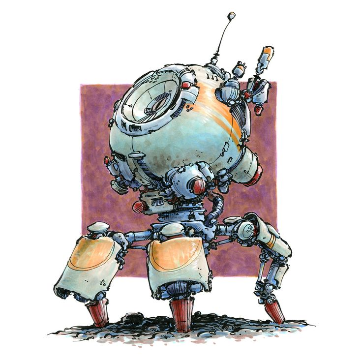

<!--# Hi there, I'm Ali Falah 👋

Thanks for stopping by my GitHub profile!

Please refer to my main profile [here](https://github.com/Ali-Falah-Humda).

Looking forward to connecting with you there!

!


**falireza/falireza** is a ✨ _special_ ✨ repository because its `README.md` (this file) appears on your GitHub profile.

Here are some ideas to get you started:

- 🔭 I’m currently working on ...
- 🌱 I’m currently learning ...
- 👯 I’m looking to collaborate on ...
- 🤔 I’m looking for help with ...
- 💬 Ask me about ...
- 📫 How to reach me: ...
- 😄 Pronouns: ...
- ⚡ Fun fact: ...
-->

# Hello World! 🌌

<!---->

Thanks for stopping by my GitHub profile!

<p align='left'>
I am a Robotics Research Engineer with a passion for pushing the boundaries of what's possible in autonomous systems.
</p>

### My Expertise Includes:
- **Environment Perception, Sensor Fusion, Cameras, and LiDARs**  
- **Robot Operating System (ROS) Development with Modern C++**  
- **Reinforcement Learning and Robotics Simulations**


> "Given two rewarding stimuli, animals tend to choose the more rewarding (or less effortful) option. However, they also move faster toward that stimulus."

Here is me in the Abu Dhabi Autonomous Racing League: [A2RL](/images/withcar.jpg)


[](mailto:al.r.falah@gmail.com)

<!--


```python
def main():
    name = "[Your Name]"
    location = "[Your Location]"
    favorite_editor = "[Your Favorite Editor]"

    print(f"\nName: {name}")
    print(f"Living in: {location}")
    print(f"Favourite editor: {favorite_editor}\n")

if __name__ == "__main__":
    main()
